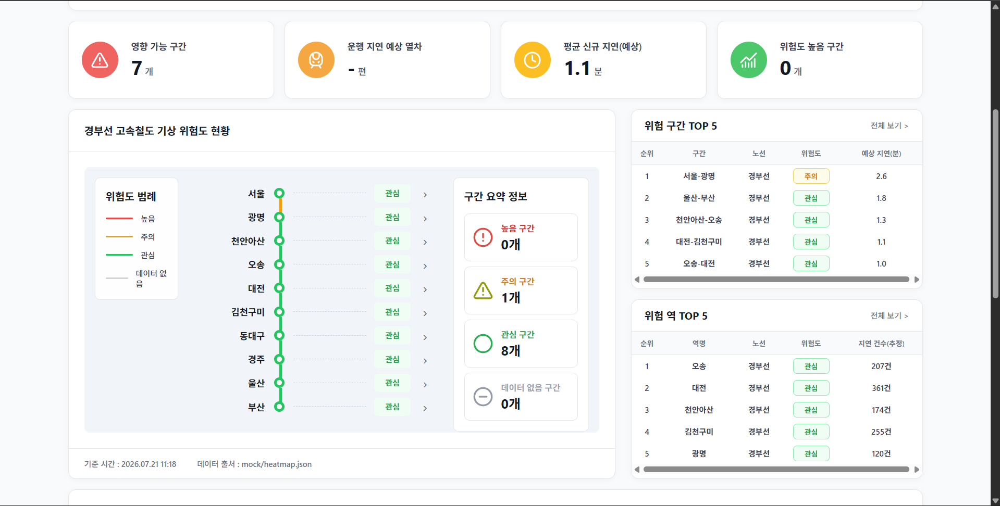
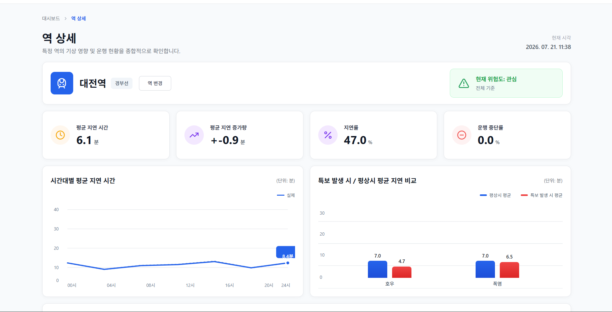
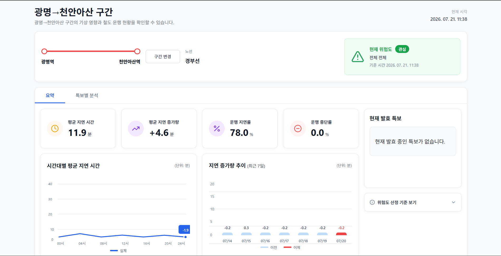

# 경부선 기상 취약구간 사전 점검 대시보드

> 호우·폭염 특보가 철도 운행에 미치는 영향을 분석해, **취약한 역·구간을 사전에 파악**하도록 돕는 데이터 기반 의사결정 지원 대시보드.


`git clone` 후 **`docker compose up` 한 줄**이면 대시보드와 API가 뜹니다. → **http://localhost:8000**

---

## 📌 소개

기상청과 공공데이터포털은 기상특보·여객열차 운행계획·운행실적 같은 데이터를 각각 다른 시스템으로 제공합니다. 관리자가 "지금 이 특보에 어떤 역·구간을 먼저 점검해야 하는가"를 종합적으로 판단하기는 어렵습니다.

이 프로젝트는 **기상청 API 허브의 호우·폭염 특보**와 **공공데이터포털의 여객열차 운행계획·운행실적**을 공통된 시간·지역 기준으로 연계해, 최근 3개월간 경부선의 역별 지연 현황과 인접 역 사이 구간의 지연 증가량을 분석합니다. 이를 바탕으로 특보에 취약한 역·구간을 산출하고, **현재 발효 중인 특보**와 함께 순위·히트맵·상세 지표·우선 점검 대상으로 시각화합니다.

**이 시스템이 하는 것 / 하지 않는 것**

- ✅ 과거 운행실적 + 현재 기상특보로 **위험 가능성이 높은 역·구간을 우선 파악**하는 사전 점검·대비용 도구
- ✅ 분산된 기상·철도 정보를 **하나의 화면**에서 확인
- ❌ 실시간 열차 관제나 사고 예측은 목적이 아님 (운행실적은 **1일 지연** 과거 데이터)

---

## ✨ 주요 기능

- **위험 역·구간 순위** — 평상시 대비 특보 시 지연 증가량·지연 발생률 기준으로 취약도를 산정해 내림차순 제공
- **노선 히트맵** — 경부선 10개 역·9개 구간의 기상 취약도를 한눈에
- **역 상세 / 구간 상세** — 특보 종류별 지연 현황, 평상시 대비 특보 시 차이, 시간대별·구간별 지연 변화
- **현재 발효 특보 연계** — 역의 특보구역 정보로 특보 지역과 경부선 역·인접 구간을 연결해 영향 대상 제시
- **우선 점검 대상** — 위험 등급뿐 아니라 **판단 근거와 권고 조치**를 함께 제시
- **데이터 부족 구분** — 표본이 적은 경우를 낮은 위험으로 처리하지 않고 별도 `데이터 부족` 상태로 구분하고, 표본 수로 신뢰 수준을 함께 표시
- **AI 어시스턴트 (BETA)** — 화면 지표와 프로젝트 문서를 근거로 답하는 RAG 기반 질의 (백엔드 `POST /rag/ask` 구현, 프론트 드로어는 현재 Mock UI 단계)
- **Mock / 실제 DB 동일 계약** — DB 없이도 mock 데이터로 화면이 그대로 동작

---

## 🖥️ 화면 구성

**메인 대시보드** — 영향 가능 구간·평균 신규 지연 등 요약 카드, 경부선 기상 위험도 히트맵, 위험 구간·위험 역 TOP 5, 구간 요약(높음/주의/관심/데이터 없음).



**역 상세** — 현재 위험도 등급, 평균 지연 시간·지연 증가량·지연률·운행 중단률, 시간대별 평균 지연, 특보 발생 시 vs 평상시 지연 비교(호우·폭염).



**구간 상세** — 인접 역 사이 지연 증가량, 과거 특보별 분석, 구간 관련 발효 특보.

---

## 🧱 기술 스택

| 영역 | 사용 기술 |
|---|---|
| 백엔드 | FastAPI (읽기 전용 API), Pydantic (계약 검증), psycopg3 |
| 데이터베이스 | PostgreSQL 16 + **TimescaleDB** (시계열 하이퍼테이블) |
| 프론트엔드 | vanilla JavaScript · HTML · CSS (외부 차트/지도 라이브러리 없음, Lucide SVG 아이콘) |
| RAG / LLM | LiteLLM 프록시(모델 게이트웨이) + 파일 기반 JSON 인덱스 |
| 인프라 | Docker Compose (단일 포트 8000, 프로파일로 DB·RAG 분리) |
| 데이터 출처 | 기상청 API 허브(기상특보), 공공데이터포털(여객열차 운행계획·운행실적) |

> 전체 의존성·버전은 [`TECH_STACK.md`](./TECH_STACK.md) 참고.

---

## 🏗️ 아키텍처

```
공공데이터(기상특보 · 운행계획 · 운행실적)
        │  수집
        ▼
   collector/  ──▶  TimescaleDB  ◀──  processor/
   (수집·적재)      (시계열 통합)      (지연 계산 · 취약도 집계)
                        │  읽기 전용
                        ▼
                   backend/ (FastAPI API)
                        │  
                        ▼
                   frontend/ (대시보드)
```

- 수집·분석 영역과 백엔드·프론트가 **동일한 API 응답 형식**을 쓰도록 [`CONTRACT.md`](./CONTRACT.md)에 키·단위·정렬·오류 형식을 데이터 계약으로 정의했습니다. **다른 문서와 어긋나면 CONTRACT가 우선**합니다.
- 그 덕분에 실제 DB(`USE_MOCK=0`)와 가상 데이터(`USE_MOCK=1`)가 같은 응답 모양을 갖고, 데이터 연결 방식이 바뀌어도 프론트 로직은 그대로입니다.
- 취약도는 관측 사실 집계(지연 증가량·지연 발생률·표본 수) 기반의 규칙으로 산정하며, 등급 산정 단일 기준은 `backend/risk_rules.py`입니다.

---

## 🚀 빠른 시작

필요한 것은 **Git**과 **Docker**(`docker compose` v2 포함)뿐입니다. Python 설치·가상환경·패키지 설치는 필요 없습니다 — 전부 컨테이너 안에서 처리됩니다.

```bash
git clone https://github.com/Asca-lon/trail-dashboard.git
cd trail-dashboard
docker compose up
```

- 대시보드 → **http://localhost:8000**
- API 문서(Swagger) → http://localhost:8000/docs
- 헬스체크 → http://localhost:8000/health

기본은 **mock 모드**(A의 DB 없이 `mock/*.json`으로 동작)입니다. **실제 DB 모드**와 **RAG(실제 AI 답변)** 실행은 API 키·프로파일이 필요하며, 단계별 안내는 [`QUICKSTART.md`](./QUICKSTART.md)에 있습니다.

| 하고 싶은 것 | 명령 |
|---|---|
| 대시보드+API (mock, 키 불필요) | `docker compose up` |
| RAG 스택 (mock 지표 위) | `USE_MOCK=1 docker compose --profile rag up -d --build` |
| RAG 인덱스 최초 생성 | `docker compose --profile rag run --rm rag-ingest` |
| 실제 DB | `USE_MOCK=0 docker compose --profile db up` |

---

## 🔐 환경 변수 (.env)

`docker compose up`(mock) 만 쓸 땐 `.env` 가 필요 없습니다. **실제 DB·데이터 수집·RAG** 를 쓰려면 `cp .env.example .env` 후 아래 값을 채웁니다.

| 변수 | 필요 시점 | 설명 |
|---|---|---|
| `USE_MOCK` | 항상 | `1`=mock(기본), `0`=실제 DB 조회 |
| `DATABASE_URL` · `POSTGRES_PASSWORD` | DB 모드 | Postgres 접속 정보 (compose 기본 계정 `trail`) |
| `PUBLIC_DATA_API_KEY` | 데이터 수집 | 공공데이터포털(코레일 운행) 키 |
| `KMA_API_KEY` | 데이터 수집 | 기상청 API 허브(특보) 키 |
| `RAG_ENABLED` | RAG | `1`이면 `/rag/ask` 활성화 |
| `GEMINI_API_KEY` | RAG | LiteLLM 이 호출할 LLM 공급자 키 |
| `LITELLM_MASTER_KEY` · `LITELLM_API_KEY` | RAG | LiteLLM 프록시 인증키 (같은 값 사용) |
| `LITELLM_CHAT_MODEL` · `LITELLM_EMBED_MODEL` | RAG | 채팅·임베딩 모델명 (공급자 교체 지점) |

> `KORail_*`·`MOLIT_*`·`KMA_*_URL` 같은 엔드포인트 URL 은 기본값이 있어 보통 손대지 않습니다. `.env` 는 `.gitignore` 라 커밋되지 않습니다(키 유출 방지).

---

## 🔌 API 개요

읽기 전용 REST API. 응답은 모두 CONTRACT §5 형식을 따릅니다.

| 메서드 · 경로 | 설명 |
|---|---|
| `GET /lines` | 노선·역 목록 |
| `GET /vulnerability/stations` | 역별 취약도 순위 |
| `GET /vulnerability/segments` | 구간별 취약도 순위 |
| `GET /heatmap` | 노선 히트맵(역·구간 등급) |
| `GET /station/{station_id}` | 역 상세(시간대별 지연, 평상시 대비 특보 비교) |
| `GET /segments/details` | 구간 상세 번들 |
| `GET /checklist` | 우선 점검 대상 Top-N |
| `GET /alerts/active` | 현재 발효 특보 + 영향 역·구간 |
| `POST /rag/ask` · `GET /rag/health` | RAG 질의 / 상태 |
| `GET /health` · `GET /docs` | 헬스체크 / Swagger 문서 |

공통 필터: `line`, `alert_type`(**호우/폭염** — 현재 스코프), `alert_level`(주의보/경보), `train_type`(all/KTX/무궁화/새마을).

**응답 원칙 (§5-1)** — 키는 항상 존재하고 빈 값은 `[]`/`null`(오류 아님), 표본 0은 `200 + []`·오류만 `4xx/5xx`, 순위는 취약도 내림차순, 지연=분·비율=0~1, 오류는 `{ "error": { "code", "message" } }` 형식으로 통일.

---

## 📁 저장소 구조

```
trail-dashboard/
├─ README.md
├─ CONTRACT.md            # 단일 진실 원천 (API 데이터 계약)
├─ QUICKSTART.md          # clone 후 바로 실행
├─ Docker_run.md          # 도커 설치·실행 상세
├─ docker-compose.yml     # api · litellm · rag-ingest · db (프로파일로 분리)
├─ Dockerfile             # 백엔드 API + 정적 프론트를 한 이미지로
├─ serve.py               # api.app + frontend/·mock/ 정적 마운트(단일 포트 8000)
├─ .env.example
├─ db/                    # A — 스키마·시드
│  ├─ init_schema.sql       # 스키마(§4). TimescaleDB 하이퍼테이블 포함
│  ├─ seed_stations.sql     # 경부선 역·특보구역 매핑(station_regions 1:N)
│  └─ migrate_*.sql
├─ collector/             # A — 수집·적재 (운행계획·운행실적·특보 → DB)
├─ processor/             # A — 분석 (지연 계산 · 역/구간 취약도 집계)
├─ backend/               # B — 읽기 전용 API
│  ├─ api.py                # FastAPI 엔드포인트 (CONTRACT §5)
│  ├─ models.py             # pydantic 응답 모델 = 계약을 코드로
│  ├─ risk_rules.py         # 위험도 등급 산정 단일 기준
│  ├─ db.py                 # 조회 전용
│  └─ rag/                  # RAG 설명 레이어
├─ litellm/               # B — LiteLLM 프록시 설정(RAG 모델 게이트웨이)
├─ frontend/              # C — vanilla JS/HTML (대시보드·역/구간 상세·AI 드로어)
├─ index.html            # 루트 접속 → frontend/dashboard.html
└─ mock/                 # 공유 — CONTRACT §5 모양의 mock JSON (병렬 작업의 핵심)
```

---

## 🗂️ 데이터 출처 & 범위

- **출처**: 기상청 API 허브(호우·폭염 특보 이력·현재 현황), 공공데이터포털(여객열차 운행계획·운행실적)
- **범위**: 경부선 · 호우·폭염 특보 · 최근 3개월 (다노선·타 기상현상 확장 가능한 구조)
- **적재**: 최초 3개월 일괄 수집 후, 전일 확정 데이터를 더하는 일일 배치
- **주의**: 운행실적은 1일 지연 과거 데이터 → 실시간 관제가 아닌 **사전 점검 참고자료**

---

## 📚 문서

| 문서 | 내용 |
|---|---|
| [`CONTRACT.md`](./CONTRACT.md) | **단일 진실 원천** — API 데이터 계약(키·단위·정렬·오류 형식) |
| [`QUICKSTART.md`](./QUICKSTART.md) | clone 후 실행 (mock·RAG·DB 모드, 트러블슈팅) |
| [`Docker_run.md`](./Docker_run.md) | 도커 설치·실행 상세 (OS별) |
| [`TECH_STACK.md`](./TECH_STACK.md) | 사용 기술·버전 목록 |
| [`server_RUN.md`](./server_RUN.md) | 서버(SSH·uvicorn) 직접 실행 |
| [`API_GUIDE.md`](./API_GUIDE.md) | LLM,임베딩 모델 차이와 api키 설정방법 |
| `.docs/` | 화면 설계·RAG·리팩터링 등 상세 설계 문서 |

---

## 👥 팀 구성

| 담당 | 영역 | 폴더 |
|---|---|---|
| A | 데이터 수집·적재, DB·파이프라인 | `db/` `collector/` `processor/` |
| B | 백엔드 API, 통합·계약 관리, RAG | `backend/` `litellm/` |
| C | 프론트엔드 대시보드 | `frontend/` |

---

## 🧪 테스트

```bash
cd backend
USE_MOCK=1 python -m pytest -q
```

응답 모델 ↔ mock 동기화, 허용 특보·필터 방어, 취약도 정렬, 표본 부족 처리, 역·구간 식별자, RAG 대상 해석 등을 검증합니다.

---

## 📝 개발 메모

- **가상 데이터 우선**: 실제 DB/공공데이터 연결 전에도 프론트·API를 개발·검증할 수 있도록 mock 모드 제공.
- **GitHub Pages(mock 호스팅)**: Settings → Pages → `main` `/(root)` 배포 시 `https://<계정>.github.io/<레포>/`로 화면을, `/mock/*.json`으로 mock을 노출. C는 이 URL로 화면을 만들고 백엔드 완성 후 base URL만 교체.

---

## 📄 라이선스

학습·연구 목적의 현장실습 팀 프로젝트(캡스톤) 결과물입니다. 사용한 오픈소스 라이브러리는 각자의 라이선스를 따르며, 참고·재사용한 외부 코드의 저작권은 각 원저작자에게 있습니다. 상업적 이용·재배포 전에는 사용된 구성요소의 라이선스를 확인하세요.
